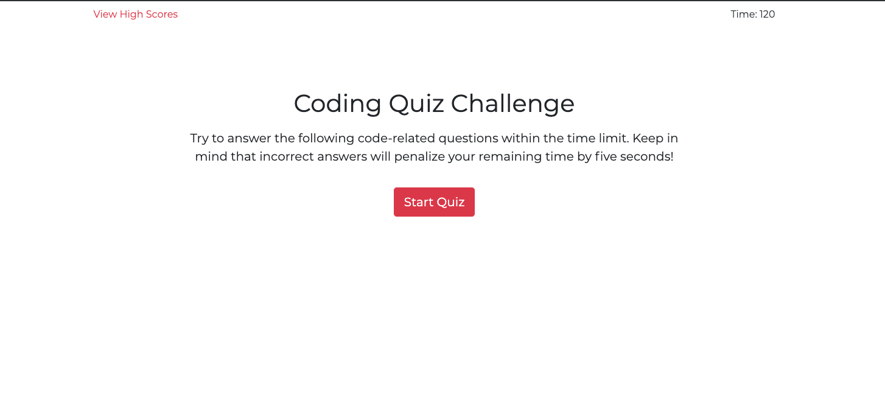
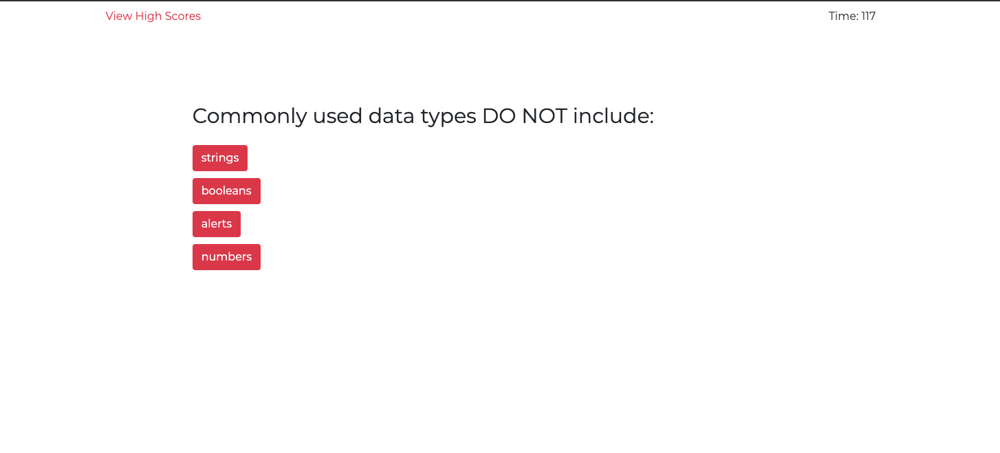
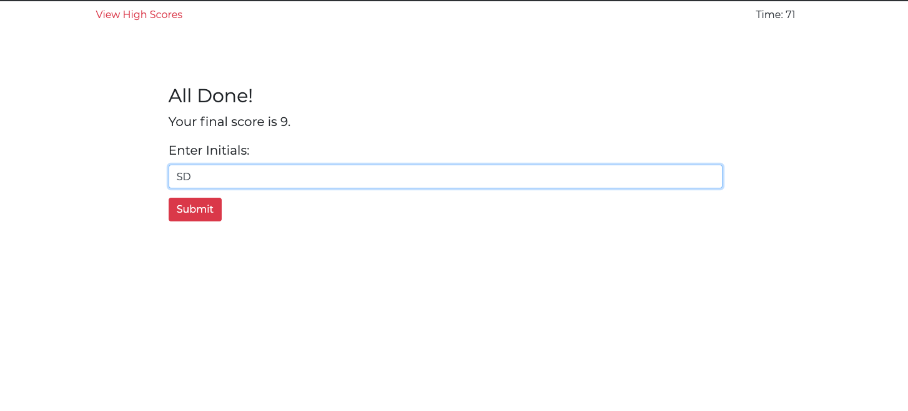
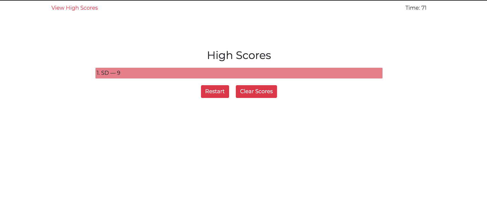

# Code Quiz

This a web browser app that tests a user on JavaScript concepts. It is multiple choice and has a time constraint. Instructions are as follows:

## Usage

* Quiz begins after the user clicks the START button, the timer begins.

* The user will be presented with a question. If the user answers correctly, they will be notified as such and will move on to the next question. Their score will increase and they will be given additional time.

* If the user answers incorrectly, they will be notified as such and time will be subtracted. 

* The quiz will end once all questions are answered or once the time has run out.

* When the quiz is over, the user can input their initials and have their score (the number of questions answered correctly) logged into a scoreboard of high scores.

* The user can then view all high scores or go back to the Start menu.

NOTE: high scores can be viewed before a new quiz has started, as well as cleared to remove all current high scores.

See https://mattjavier.github.io/code-quiz/ to view application.

## Images

* The start of the application
  

* A question on the quiz
  

* The final score on a quiz attempt
   

* The list of high scores, stored in local storage
  
